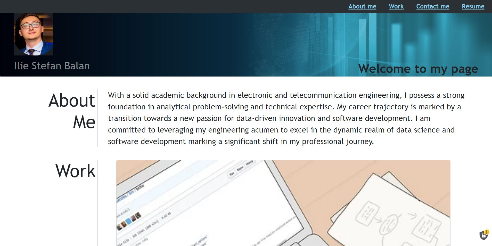
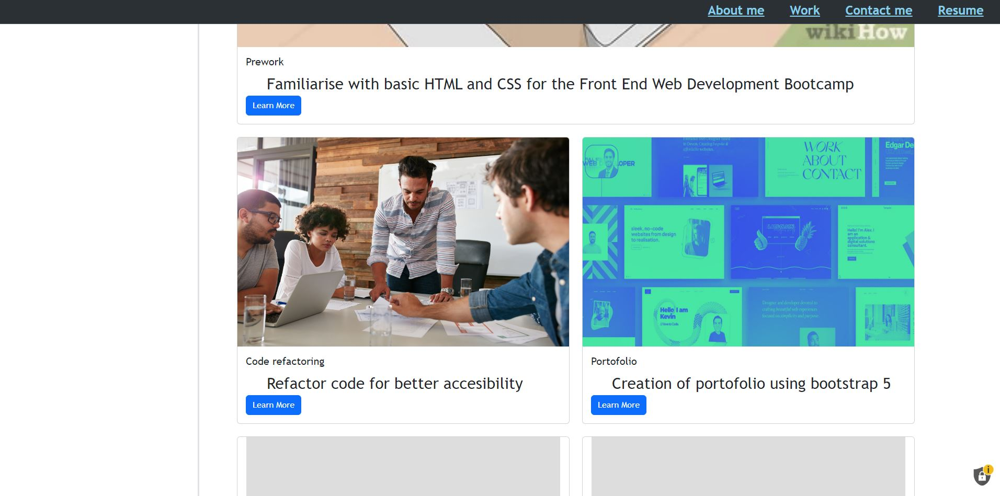
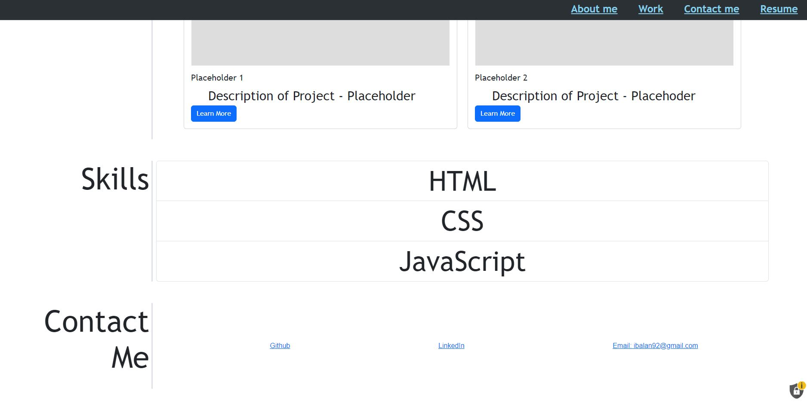

## My portofolio

## Description 

 This project consists in a web application that gives access to the user to a developers portofolio.
 Bootstrap 5 was used for improving the styling of the website.
 The website should look similar to the screenshots below:

The website can be visited here: https://ibalan92.github.io/Bootstrap-Portfolio/

## Installation

N/A

## Contact

If you find any errors in the code or any malfunction, please "pull request" on github and I will review it. 

## License

Please refer to the LICENSE in the repo.